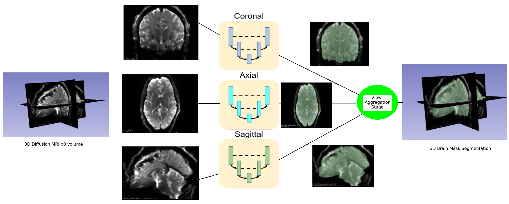

[](https://doi.org/10.5281/zenodo.3665739) []() []()

*CNN-Diffusion-MRIBrain-Segmentation* repository is developed by Senthil Palanivelu, Suheyla Cetin Karayumak, Tashrif Billah, Sylvain Bouix, and Yogesh Rathi, 
Brigham and Women's Hospital (Harvard Medical School).

Table of Contents
=================

   * [Table of Contents](#table-of-contents)
   * [Segmenting diffusion MRI brain](#segmenting-diffusion-mri-brain)
   * [Citation](#citation)
   * [Dependencies](#dependencies)
   * [Installation](#installation)
      * [1. Python 3](#1-python-3)
      * [2. Conda environment](#2-conda-environment)
         * [CPU only](#cpu-only)
         * [GPU support](#gpu-support)
      * [3. CUDA environment](#3-cuda-environment)
      * [4. Download models](#4-download-models)
   * [Running the pipeline](#running-the-pipeline)
      * [Prediction](#prediction)
      * [Training](#training)
         * [1. B0 extraction](#1-b0-extraction)
         * [2. Registration](#2-registration)
         * [3. Preprocessing](#3-preprocessing)
         * [4. Deep learning](#4-deep-learning)
   * [Method](#method)
      * [1. Model Architecture](#1-model-architecture)
      * [2. Multi View Aggregation:](#2-multi-view-aggregation)
      * [3. Clean up](#3-clean-up)
   * [Issues](#issues)
   * [Reference](#reference)

Table of contents created by [gh-md-toc](https://github.com/ekalinin/github-markdown-toc)


# Segmenting diffusion MRI brain

A challenging problem in neuroscience is to create brain mask of an MRI. The problem becomes more challenging when 
the MRI is a diffusion MRI (dMRI) since it has less contrast between brain and non-brain regions. Researchers all over the 
world have to spent many hours drawing dMRI brain masks manually. In order to automate that process, we come up with a 
convolutional neural network (CNN) based approach for creating dMRI brain mask automatically. The CNN architecture is 
obtained from Raunak Dey's [work](https://github.com/raun1/MICCAI2018---Complementary_Segmentation_Network-Raw-Code). 
On top of that, we applied a multi-view aggregation step to obtain final brain mask.

The software is capable of both training and predicton. We also provide trained models so it can be used off the shelf.
Psychiatry NeuroImaging Laboratory has a large number of dMRI brain masks drawn by research assistants. 
The models were trained on 1,500 such brain masks. We acchieved an accuracy of 97% in properly segmenting the brain 
from a dMRI b0 volume.


# Citation

If you use this software, please cite all of the following:

* Palanivelu S, Cetin Karayumak S, Billah T, Bouix S, Rathi Y; CNN based diffusion MRI brain segmentation tool, 
https://github.com/pnlbwh/CNN-Diffusion-MRIBrain-Segmentation, 2020, DOI: 10.5281/zenodo.3665739

* Dey, Raunak, and Yi Hong. "CompNet: Complementary segmentation network for brain MRI extraction." 
International Conference on Medical Image Computing and Computer-Assisted Intervention. Springer, Cham, 2018.

* Roy, Abhijit Guha, et al. "QuickNAT: A fully convolutional network for quick and accurate segmentation of neuroanatomy." 
NeuroImage 186 (2019): 713-727.


# Dependencies

* python 3
* ANTs

# Installation

## 1. Python 3

Download [Miniconda Python 3 bash installer](https://docs.conda.io/en/latest/miniconda.html) (32/64-bit based on your environment):
    
    sh Miniconda3-latest-Linux-x86_64.sh -b # -b flag is for license agreement

Activate the conda environment:

    source ~/miniconda3/bin/activate # should introduce '(base)' in front of each line

The software is written intelligently to work with or without GPU support. Two *yml* environment files 
are provided to facilitate creation of `dmri_seg` conda environment.
   
## 2. Conda environment
   
### CPU only

> conda env create -f environment_cpu.yml


### GPU support

> conda env create -f environment_gpu.yml
       
Finally, activate the conda environment using:

    conda activate dmri_seg
    

## 3. CUDA environment

When you have GPU support, provided that you used `environment_gpu.yml` for creating conda environment, 
you should set environment variables in order to run and write CUDA enabled programs. 
The NVIDIA graphics driver and CUDA compilier are already installed on machines that support CUDA. 

If you use bash, add the following lines to the bottom of your `~/.bashrc` file:

    # add cuda tools to command path
    export PATH=/usr/local/cuda/bin:${PATH}

    # add the CUDA binary and library directory to your LD_LIBRARY_PATH
    export LD_LIBRARY_PATH=$LD_LIBRARY_PATH:/usr/local/cuda-9.0/lib64
  
Open a new terminal for the changes to take effect.


## 4. Download models

Download model architecture, weights and IIT mean b0 template from https://github.com/pnlbwh/CNN-Diffusion-MRIBrain-Segmentation/releases 
as follows:

    cd CNN-Diffusion-MRIBrain-Segmentation
    wget https://github.com/pnlbwh/Harmonization-Python/releases/download/v0.1/model_folder.tar.gz
    tar -xzvf model_folder.tar.gz

They will be extracted to `CNN-Diffusion-MRIBrain-Segmentation/model_folder` directory.


# Running the pipeline


## Prediction

Prediction refers to creation of masks based on pre-trained model. This is the common use of this software.
    
    pipeline/dwi_masking.py -i dwi_list.txt -f model_folder
    pipeline/dwi_masking.py -i dwi_list.txt -f model_folder -nproc 16
    
* `dwi_list.txt` should contain the full path to the diffusion volumes

* Each created mask is saved in directory its diffusion volume with name `dwib0_{PREFIX}-multi_BrainMask.nii.gz`


## Training

However, you can train a model on your own data using this software. 
Data refers to a set of b0 images and their corresponding masks.
Training is performed in four steps:

### 1. B0 extraction

In the training stage, we train a CNN to predict b0 brain mask with reasonable accuracy. For the CNN to learn masking, 
we have to provide a set of b0 images and their corresponding masks. So the first step in training would extracting 
b0 image given a DWI. You can use your favorite tool, bvalue threshold, and method (first b0 or average over all b0s) 
to obtain b0 image. Then, researchers usually draw masks by hand or edit FSL `bet` produced masks. 
Once you have a set of b0s and their corresponding masks, you can start the next steps.


### 2. Registration

This software uses `IITmean_b0_256.nii.gz` image as the reference that you can download 
from https://www.nitrc.org/frs/?group_id=432 . If your b0s and corresponding masks are already in the space of 
`IITmean_b0_256.nii.gz` (ICBM-152/MNI152), you do not need to register again.

Example:

    src/registration.py -b0 b0_list.txt -mask mask_list.txt -ref model_folder/IITmean_b0_256.nii.gz
    

The registered images are stored in the directory of given images as `{Prefix}-Warped.nii.gz` and 
`{Prefix}-Warped-mask.nii.gz`.

### 3. Preprocessing

Whether you register the images or not, create a text file for with their absolute paths:

> b0_list.txt

    /path/to/case1_b0.nii.gz
    /path/to/case2_b0.nii.gz
    ...
    

> mask_list.txt

    /path/to/case1_mask.nii.gz
    /path/to/case2_mask.nii.gz
    ...
    
Make sure to account for registered paths if have have done so.

Then, we normalize b0 image to the range [0,1] with respect to its highest intensity. 
Same clipping is performed to the mask. 

    src/preprocess_b0.py -i b0_list.txt
    src/preprocess_mask.py -i mask_list.txt    

Upon preprocessing, b0 data are appended to:
    
    sagittal-traindata-dwi.npy
    coronal-traindata-dwi.npy
    axial-traindata-dwi.npy

Similarly, mask data are appended to files with `-mask.npy` suffix. The above `*.npy` files are saved in 
the directory of the first b0 image given in `b0_list.txt`.


### 4. Deep learning

Now we come to the actual machine learning stage. We want to train our CNN varying `principal_axis` 
over the set `{axial,coronal,saggittal}` one at a time. 

Copy the `src/settings.ini` to a different directory and edit relevant fields:

```ini
[COMMON]
save_model_dir = "project/model_dir/"
log_dir = "project/log_dir"

[DATA]
data_dir = "project/dir/of/first/case/"
train_data_file = "sagittal-traindata-dwi.npy"
train_label_file = "sagittal-traindata-mask.npy"

[TRAINING]
principal_axis = "sagittal"
learning_rate = 1e-3
train_batch_size = 4
validation_split = 0.2
num_epochs = 1
shuffle_data = "True"
```

At the very least, you should edit `save_model_dir`, `log_dir`, and `data_dir` fields. Now define 
environment variable `COMPNET_CONFIG` so your own `settings.ini` could be found by `src/train.py` program:

    export COMPNET_CONFIG=/path/to/your/settings.ini

Finally, you can use the same `settings.ini` file for training three models corresponding to three 
principal axes- `sagittal`, `coronal`, and `axial`. For each of the axes, run:

    src/train.py  # for sagittal
    src/train.py  # for coronal
    src/train.py  # for axial


`src/train.py` will save three `*-compnet_final_weight.h5` models in `save_model_dir` that you defined in `settings.ini`.
You can use this `model_folder` for [prediction](#prediction)


# Method

## 1. Model Architecture

The code is written by Raunak Dey available at 

https://github.com/raun1/MICCAI2018---Complementary_Segmentation_Network-Raw-Code. 

In summary, his proposed architecture is designed in the framework of encoder-decoder networks and have three pathways.

* Segmentation Branch - learns what is the brain tissue and to generate a brain mask 

* Complementary Branch - learns what is outside of the brain and to help the other
branch generate brain mask

* Reconstruction Branch - It provides direct feedback to the segmentation and
complementary branche and expects reasonable predictions from them as input to reconstruct the original input image.


**Illustration kindly provided by Raunak Dey**


## 2. Multi View Aggregation:

The approach is to train three separate networks for three principal axes ( Sagittal, Coronal and axial ) and 
to perform multi-view aggregation step that combines segmentations from models trained on 2D slices along three principal axes: 
coronal, sagittal and axial. The final segmentation is obtained by combining the probability maps from all three segmentation.




See [Reference #2](#reference) for details of this method.


## 3. Clean up

The aggregated mask is cleaned up using a [Python translated version](../src/maskfilter) of [maskfilter from mrtrix](https://mrtrix.readthedocs.io/en/latest/reference/commands/maskfilter.html). 
In brief, there remain islands of non brain region in the aggregated mask. The above filter applies a series of morphological 
operation i.e. erosion and dilation to clean up the mask.

# Issues

If you experience any issue with using this software, please open an issue [here](https://github.com/pnlbwh/CNN-Diffusion-MRIBrain-Segmentation/issues).
We shall get back to you as soon as we can.


# Reference

* 1. Dey, Raunak, and Yi Hong. "CompNet: Complementary segmentation network for brain MRI extraction." 
International Conference on Medical Image Computing and Computer-Assisted Intervention. Springer, Cham, 2018.

* 2. Roy, Abhijit Guha, et al. "QuickNAT: A fully convolutional network for quick and accurate segmentation of neuroanatomy." 
NeuroImage 186 (2019): 713-727.

* 3. Billah, Tashrif; Bouix; Sylvain; Rathi, Yogesh; Various MRI Conversion Tools, https://github.com/pnlbwh/conversion, 2019, 
DOI: 10.5281/zenodo.2584003


